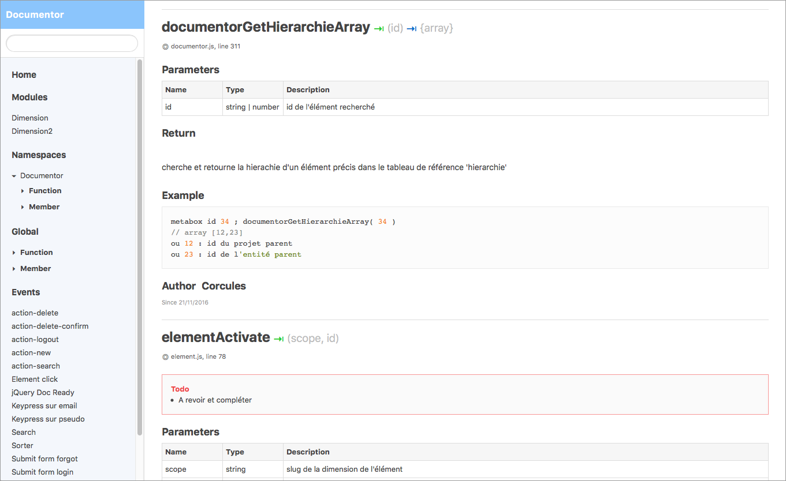

# corcules-jsdoc
Simple and clean jsdoc template with hierarchical navigation and search

* [JSDOC](https://github.com/jsdoc3/jsdoc)
* [Use JSDOC](http://usejsdoc.org)

**Note :** - 12/06/2016 - this template is currently under construction. It should working properly but :
* Some JSDOC Tags are not yet implemented, such as `@construct`, `@fires`, `@default`, ...
* Hierarchical navigation and inner search for `@module` are not available
* Some template options are not yet functional

This template is based on the default JSDOC template.




---


## Options

Template options are available via the conf.json under the `templates` object:
```javascript
{
    "templates": {
        "menu": {
            "defaultsortby": "longname, version, since",
            "modules": {
                "show": true
            },
            "namespaces": {
                "show": true,
                "showchildren": true,
                "sortby": "kind"
            },
            "classes": {
                "show": true,
                "showchildren": true,
                "sortby": "kind"
            },
            "globals": {
                "show": true,
                "sortby": "kind"
            },
            "events": {
                "show": true,
                "sortby": "",
                "filtermodule": true
            },
            "mixins": {
                "show": true
            },
            "interfaces": {
                "show": true
            },
            "tutorials": {
                "show": true
            },
            "externals": {
                "show": true
            }
        }
    }
}
```
### Global sorting
templates.*menu*.**defaultsortby** : a doclet properties, separated by comma, for sorting the navigation menu.
`"longname, version, since"` is the default jsdoc sort.

### Visibility
Each main jsdoc category ( modules ; namespaces ; classes ; globals ; events ; mixins ; interfaces ; tutorials ; externals ) can be hidden from the navigation. Note that there are not completely desactivated, just hidden from navigation.
templates.*menu*.*category*.**show** : true (default) | false

### Namespaces and classes children
List child entries for namespaces and classes. If false, only namespaces or classes names are printed.
templates.*menu*.*namespaces*.**showchildren** : true (default) | false

### Group Children by
Allow children of a category to be grouped by a doclet propertie
templates.*menu*.*namespaces*.**sortby** : a doclet propertie (default "kind").<br>
**Note** : for namespaces and classes , *showchildren* as to be *true*<br>
**Note** : not yet functional on events<br>
**Note** : yes, option should be named "groupby" instead of "sortby"...

### Filtering module's events on events list
By default, events included in modules are displayed both in the main event navigation list and in module page. Unlike functions or members, it can make sense for events... or not.<br>
templates.*menu*.*events*.**filtermodule** : true (default , displayed only on module's page) | false (displayed both in events list and module page)

---

## Coming :
* Manage all jsdoc standard @tags 
* Add html rendering options in the conf.json for size and colors of the main layout
* Add html options in conf.json for title, subtitle, and other
* Hilighting todos with options in conf.json
* Generate a statistical dashboard with some settings in conf.json
* Improve *source*.js page
* Improve subnavigation and options in conf.js ( especially for modules, namespaces, classes )
* Option for navigation groups for all main categories
* Add support for some useful jsdoc plugins
* Add support for @customtag in search


